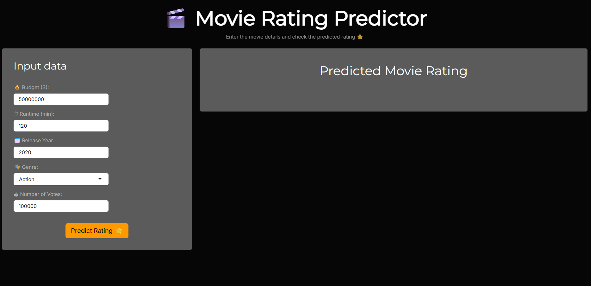
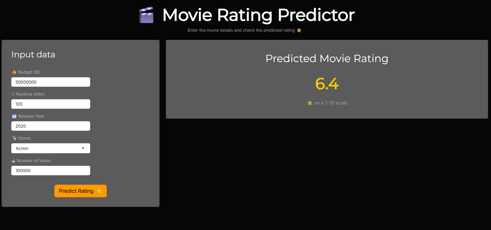

# Movie Rating Predictor

**Live Demo:**  
https://jszamik.shinyapps.io/MoviesRatingPrediction

Interactive Shiny web application that predicts a movie’s rating based on selected features such as budget, runtime, year, genre and number of votes.  
The predictive model is built using a Random Forest algorithm in R.


## Features

- Real-time movie rating predictions  
- Random Forest machine learning model  
- Shiny interface with dark theme  
- Model evaluation metrics (RMSE, MAE) available in the training script  
- Separate training and application scripts  


## Screenshots

### Main App View


### Model Training Example


## Tech Stack

- R + Shiny – interactive web application framework  
- randomForest – machine learning model  
- bslib – UI theming  
- dplyr, Metrics – data preparation and evaluation  


## Project Structure

```
project/
├── app.R              # Shiny application
├── train_model.R      # Model training and saving script
├── model/             # Saved model files (.rds)
│   ├── model_rf.rds
│   └── genre_levels.rds
├── images/            # Screenshots for README
└── .gitignore
```


## Installation and Setup

### 1. Clone the repository

```bash
git clone https://github.com/<your-username>/MoviesRatingPrediction.git
cd MoviesRatingPrediction
```

### 2. Install required packages

```r
install.packages(c("shiny", "randomForest", "bslib", "dplyr", "Metrics"))
```

### 3. Train the model

If the model files are not available, run:

```r
source("train_model.R")
```

This script:
- loads and prepares the dataset  
- trains the Random Forest model  
- saves the model and genre levels to the `model/` directory  

### 4. Run the application locally

```r
shiny::runApp("app.R")
```

The application will open in your default browser.


## Model Information

The Random Forest model was trained using the Movies Dataset by Daniel Grijalva available on Kaggle.

Dataset link:  
https://www.kaggle.com/datasets/danielgrijalvas/movies

The dataset includes movie metadata such as ratings, budgets, genres and popularity indicators.

### Dataset Overview

| Column | Description |
|--------|-------------|
| name   | Movie title |
| rating | MPAA rating |
| genre  | Movie genre |
| year   | Release year |
| released | Release date |
| score  | Average rating (target variable) |
| votes  | Number of votes |
| budget | Production budget (USD) |
| gross  | Worldwide gross revenue (USD) |
| runtime | Duration in minutes |

The following variables were used for model training:

score, budget, runtime, year, genre, votes

Data split:
- 80% training set  
- 20% test set  

Evaluation metrics calculated on the test set:
- RMSE (Root Mean Squared Error)  
- MAE (Mean Absolute Error)  

Predictions are bounded between 1 and 10 to match the rating scale.


## Deployment

The application is deployed on shinyapps.io and available at:

https://jszamik.shinyapps.io/MoviesRatingPrediction


## .gitignore (selected entries)

```gitignore
.Rhistory
.Rapp.history

.RData
.Ruserdata

.Rproj.user/
*.Rproj

rsconnect/

*.log
.DS_Store
Thumbs.db

*.tmp
*.swp
*.bak
```


## Future Improvements

- Feature importance visualization  
- Additional model diagnostics  
- Option to upload custom datasets  
- Multilingual interface  


## License

This project is released under the MIT License.


## Author

Jakub Szamik  
szamikjakub@gmail.com  
https://jszamik.shinyapps.io/MoviesRatingPrediction
